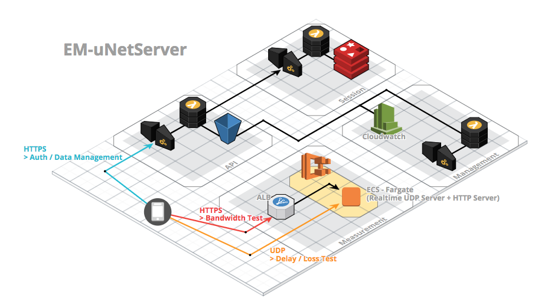

EM-uNetServer
===========================================================================================

[EM-uNetPi](https://github.com/KONAMI/EM-uNetPi) 向けのネットワーク品質測定クライアントに対する、サーバサイド側のプログラム群。

下図の通り、大きく3つの構成から成る。

AWS上での構成を前提としている。
構成手順に関しては、それぞれのディレクトリ配下の README.md をそれぞれ参照すること。

> 構築順は、Session => Measurement => API を奨励する。

- API
	- クライアントに対して、認証機能・検証結果の保存/読込機能 を提供する
- Session
	- API に対してセッション管理の機能を提供する
- Measurement
	- クライアントに対して、帯域測定のためのエンドポイント、遅延・パケロス測定のためのエンドポイントを提供する

